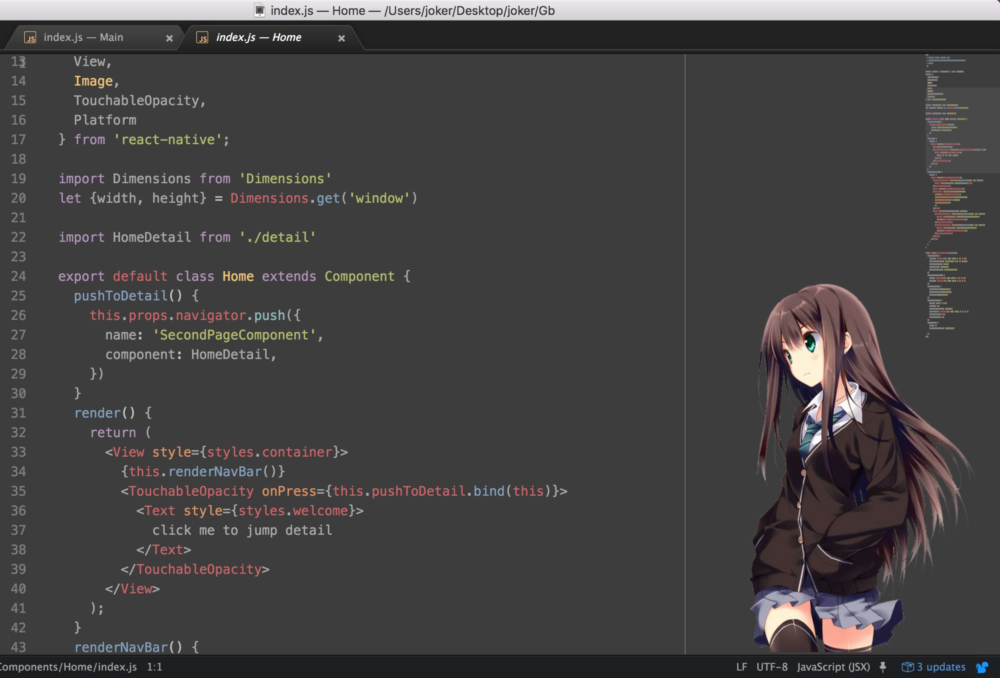

# atom-sticker

## a package to make you enjoy your coding with atom, have fun!

## Install

run `apm install atom-sticker` in your terminal, or search `atom-sticker` in Atom install panel

## Usage

`ctrl-alt-l`

## 自定义图片

* package 面板里面找到 atom-sticker 点击一下
* 然后再点一下 View code  
* 找到 styles 目录下的 atom-sticker.less
* 替换less文件里面的 background url
* 替换完要 ctrl + shift + f5

## Screenshots

## Remember: Have FUN!
